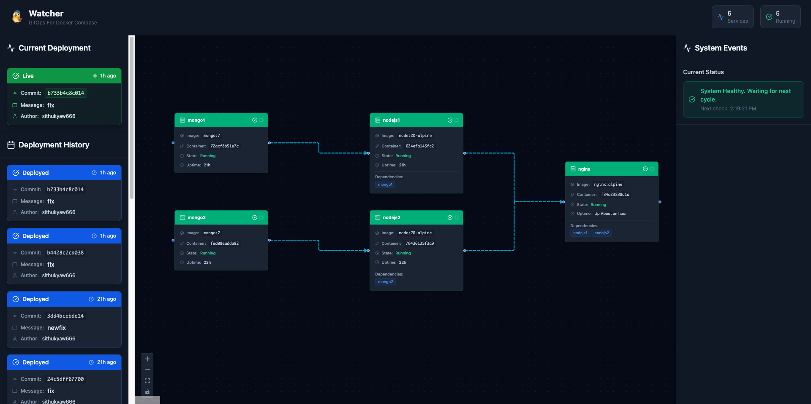
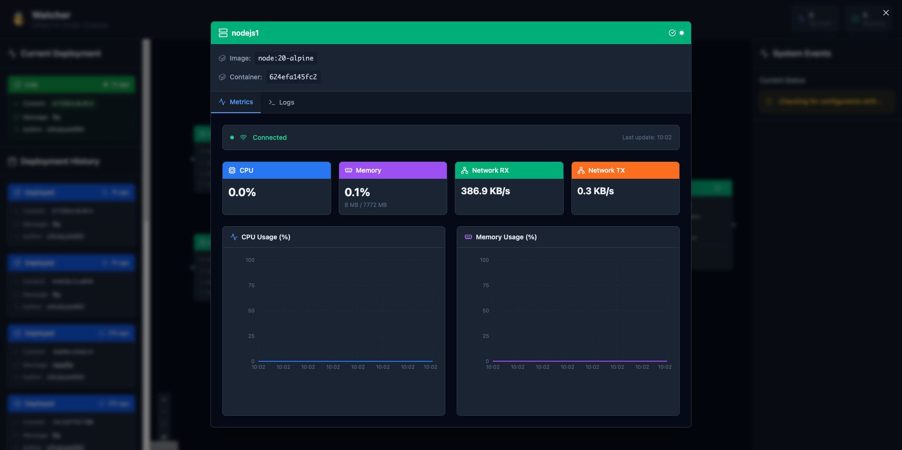
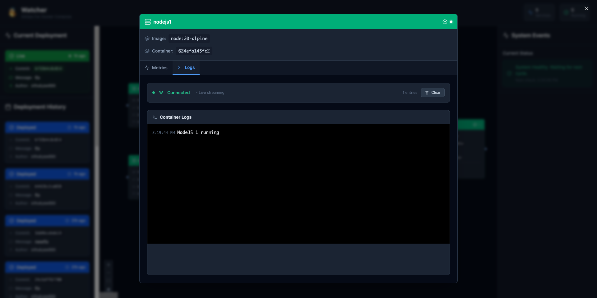
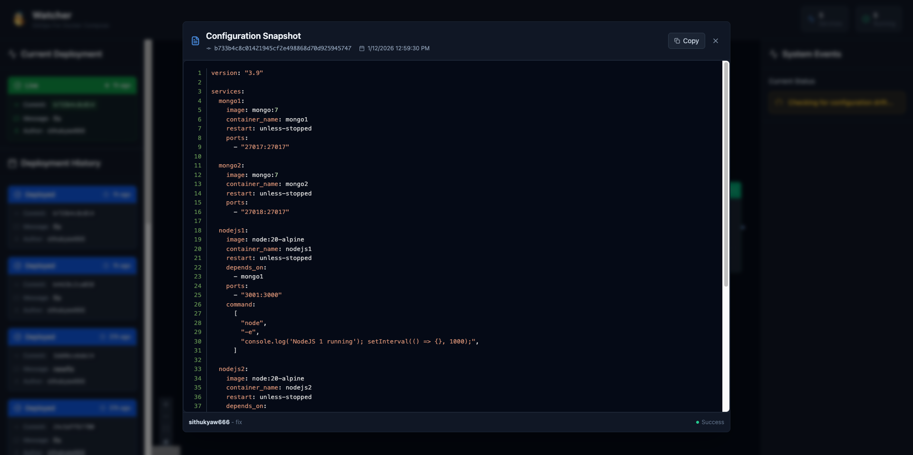

# Watcher - Native Docker Compose GitOps Engine

## Overview

**Watcher** is a lightweight, production-grade GitOps tool that automates and observes deployments for Docker Compose environments. It monitors a Git repository for changes and intelligently reconciles the desired state directly with the Docker Engine API.

Unlike traditional scripts, Watcher provides a full **Observability Suite** and a **Bulletproof Rollback System**, ensuring your applications stay healthy even when bad code is pushed.

## Motivation

While using Docker Compose in production, we wanted a tag-based container release workflow—every new image tag should trigger a deployment.

We explored tools like **Watchtower**, but found it wasn't truly GitOps-oriented. It focuses on tracking image digests/updates rather than managing the entire deployment lifecycle via version control, making it unsuitable for strict tag-driven release flows.

Our initial solution was to deploy via CI by copying `docker-compose` files to the server over SSH and running `docker compose up` manually. This approach quickly revealed significant limitations:

- **Security Risk**: Deployment servers had to be exposed (via SSH) to CI runners.
- **Secrets Management**: Private SSH keys had to be stored in CI variables.
- **Operational Burden**: Running self-hosted runners or CI agents on deployment servers wasted resources and added maintenance overhead.

**A deployment server should focus on running applications, not executing CI jobs.**

These challenges led to the creation of **Watcher**: a pull-based GitOps controller that runs _inside_ your environment, eliminating the need for incoming SSH connections or external CI agents.

## Screenshots

### Main Dashboard

Interactive visualization of your services and their dependencies, with real-time status indicators.

### Real-Time Metrics

Live resource consumption monitoring for CPU and Memory usage.

### Live Log Streaming

Streaming `stdout` and `stderr` directly to the browser for effortless debugging.

### Deployment Audit

Full history of every reconciliation cycle, including commit info and configuration snapshots.

## Core Features

- **Native Go Implementation**: Direct interaction with Docker Engine API for precise control.
- **Automatic Rollbacks**: Self-healing mechanism that automatically reverts to the last stable state if a new deployment fails or is unhealthy.
- **Commit Circuit Breaker**: Intelligent logic that identifies previously failed commits and skips them, preventing infinite "Failure-Rollback-Update" loops.
- **Interactive Web Dashboard**: Built-in UI (embedded in the binary) to visualize service dependencies, deployment history, and system status.
- **Real-Time Monitoring**: WebSocket-powered live CPU and Memory metrics for every container.
- **Live Logging**: Integrated terminal view for streaming `stdout` and `stderr` directly in the browser.
- **Dependency-Aware**: Respects `depends_on` and waits for `healthcheck` pass before proceeding with dependent services.
- **Single Binary**: The entire application, including the Frontend, is compiled into a single executable.

## Web Dashboard

Watcher serves a modern, dark-mode dashboard at `http://localhost:8080` (default).

- **Dependency Graph**: Interactive visualization of your services and their relationships.
- **Deployment Audit**: Full history of every sync, including commit messages, authors, and configuration snapshots.
- **Inspector**: Click any service to view live resource usage charts and real-time logs.
- **System Pulse**: Live status bar showing the current state of the reconciliation loop (Syncing, Reconciling, Idle).

## API & WebSockets

For advanced integration, Watcher exposes a clean REST and WebSocket API.

| Endpoint                             | Type | Purpose                                           |
| :----------------------------------- | :--- | :------------------------------------------------ |
| `GET /api/history`                   | REST | List of past deployments and statuses.            |
| `GET /api/current_deployment`        | REST | Returns the last successful (stable) deployment.  |
| `GET /api/history/view?hash=...`     | REST | View the exact YAML config for a specific commit. |
| `GET /api/graph`                     | REST | Current service status and dependency mapping.    |
| `WS /api/stream/metrics?service=...` | WS   | Real-time CPU/Mem metrics stream.                 |
| `WS /api/stream/logs?service=...`    | WS   | Live tail -f of container logs.                   |
| `WS /api/system/events`              | WS   | Real-time pulse of the GitOps engine.             |

## Configuration

Watcher is configured via a `config.yaml` file.

### `config.yaml` Parameters

- `repoURL` (string): SSH URL of the Git repository.
- `deploymentDir` (string): Path where the repo is cloned inside the container.
- `composeFile` (string): Name of the target file (e.g., `docker-compose.yaml`).
- `targetBranch` (string): Branch to monitor (e.g., `main`).
- `checkInterval` (integer): Seconds between checks (e.g., `30`).
- `sshKeyPath` (string, optional): Path to the SSH private key for Git auth.
